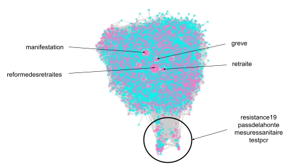
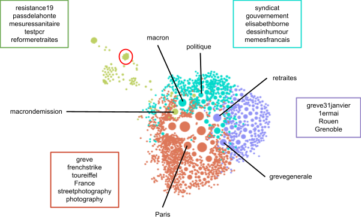
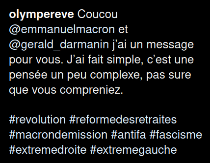
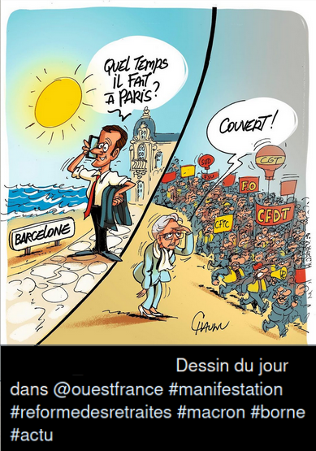
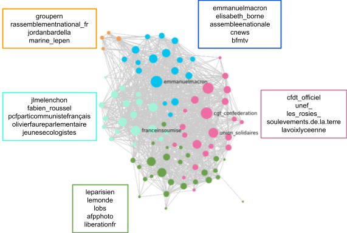

# Analyse de réseaux

Nous avons utilisé les informations contenues dans les descriptions des posts pour construire des réseaux : des premiers réseaux à partir des hashtags et des utilisateurs, et dans un second temps en utilisant les mentions et les utilisateurs. Pour cela, nous avons utilisé Python, et en particulier les librairies [networkx](https://networkx.org/) et [pelote](https://github.com/medialab/pelote) pour la manipulation de réseaux, et [ipysigma](https://github.com/medialab/ipysigma) pour la visualisation dans un Jupyter Notebook. Avant de nous lancer dans la construction des réseaux, nous avons enlevé de nos données tous les posts écrits dans un alphabet non latin. À chaque fois, la spatialisation utilisée est *Force Atlas*. L’objectif principal de ces réseaux est de comprendre les thèmes et les principaux groupes de personnes liés à la réforme des retraites, à partir donc des hashtags et des mentions utilisés.

## Réseaux à partir des hashtags et utilisateurs

Un premier réseau bipartite a été constitué : nous avons d’une part, les nœuds représentant les hashtags, et de l’autre ceux représentant des utilisateurs. Un utilisateur est relié à tous les hashtags qu’il a utilisés sur l’ensemble des posts qu’il a écrits (et qui sont dans notre corpus). Ce premier réseau était composé de 60721 nœuds et 212126 liens. Nous avons donc commencé par réduire notre réseau en enlevant les hashtags ayant été utilisés par moins de 10 utilisateurs différents, nous avons enlevé les utilisateurs ayant utilisé moins de 5 hashtags différents, et nous avons conservé la composante connexe principale. À la fin de ces étapes, notre réseau contenait 11401 nœuds, 127664 liens (on a retiré environ 80% des nœuds et 40% des liens). Sur le réseau résultant (`reseau_bipartite_hashtags_utilisateurs.html`) la taille des nœuds est proportionnelle au degré du nœud. On peut voir que le réseau n’est toujours pas très lisible, les nœuds qui ressortent sont *reformedesretraites*, *manifestation*, *greve* et *retraite*. Le plus intéressant est qu’un ensemble de nœuds semble se distinguer du reste : cet ensemble contient des hashtags comme *resistance19*, *passdelahonte*, *mesuressanitaire*. Il semblerait donc qu’un certain nombre de posts que nous avons collecté soient reliés à une communauté anti-pass sanitaire.

*Réseau bipartite après nettoyage, avec la taille des nœuds proportionnelle à leur degré. Les nœuds roses sont des hashtags et les nœuds bleus des utilisateurs*

À partir de ce réseau, nous avons pu obtenir une projection monopartite sur les hashtags (pour les utilisateurs, nous avons un identifiant difficilement interprétable, donc ces nœuds nous intéressent peu). Cette projection a donné un réseau avec 2184 nœuds et 537317 liens, nous avons donc commencé par couper tous les liens avec un poids inférieur à 5 pour y voir plus clair, ce qui nous a permis de passer à 68697 liens (on a retiré environ 90% des liens). En dehors de nous permettre d’avoir un réseau plus facile à lire, retirer ces liens permet surtout de réussir à lancer les librairies sans que des erreurs surviennent à cause du nombre de liens trop important. Enfin, sur ce réseau, nous avons utilisé la méthode de Louvain qui nous a permis de colorer différentes communautés de hashtags (l’idée de la méthode est de rassembler dans une même communauté les nœuds tels que la connexion entre nœuds d’une communauté est très dense et où les communautés ne sont pas liées entre elles).

*Projection monopartite sur les hashtags, avec application de la méthode de Louvain pour définir les couleurs des nœuds et la taille des nœuds représente leur degré. Les liens sont transparents pour faciliter la lecture du réseau*

On observe 4 communautés. En vert, on retrouve la communauté qui se dégageait sur le graphe précédent, celles des “anti-pass sanitaire”. Le nœud avec le plus gros degré de cette communauté est macrondemission. En regardant plus en détails, on retrouve des hashtags liés à différentes professions (*soignantsencolère*, plusieurs nœuds liés au secteur de la restauration et du tourisme entourée en rouge sur le réseau ci-dessus, venant de `reseau_monopartite_hashtags.html`), mais aussi des hashtags liés à d’autres actions du gouvernement (plusieurs hashtags parlant des impôts, de la réforme de l’assurance chômage, de la réforme de l’assurance maladie). L’ensemble des hashtags de cette communauté étant plus généralement critique envers le gouvernement, un titre plus large peut être “anti-gouvernement”. La communauté en bleu est un mélange de politique et d'humour. C’est-à-dire qu’on trouve aussi bien des hashtags correspondant à des noms de personnes et partis politiques (*macron*, *borne*, mais aussi *melenchon*, *rassemblementnational*) et beaucoup de hashtags liés à des dessins ou memes. On peut en déduire que lorsque des personnes et partis politiques sont utilisés comme hashtags, c’est souvent pour se moquer d’eux (voir ci-dessous pour des exemples tirés de notre corpus). La communauté violette correspond aux manifestations à l’échelle de la France : on retrouve de nombreux hashtags de la forme *greve+date*, et des noms de lieux. La dernière communauté est composée de nombreux hashtags en anglais (*demonstration*, *cops*, *parisisburning*), concernant principalement Paris, et étant reliés à la photographie (on trouve des hashtags très particuliers comme *kodak*, *argentique*). Cette communauté semble donc correspondre à du photojournalisme à destination de l’international (le fait que Paris soit le principal lieu mentionné renforce cette hypothèse puisque c'est la ville la plus connue à l’étranger).

*Deux posts de notre corpus illustrant l’utilisation des hashtags et des mentions*

En conclusion, pour ces premiers réseaux, on a découvert que les personnes parlant de la réforme des retraites sont liées à 4 communautés : une première anti-pass sanitaire, voire anti-gouvernement ; une deuxième parlant des politiques a priori dans un but humoristique ; une troisième traitant des différentes grèves sur la France entière ; et enfin une communauté couvrant les événements et s’adressant à l’international grâce à la photographie.

## Réseaux à partir des mentions et utilisateurs

Comme pour les hashtags, nous avons commencé avec un réseau bipartite avec des nœuds représentant les mentions, des nœuds représentant des utilisateurs, et un nœud utilisateur étant relié à un nœud mention si l’utilisateur a utilisé cette mention dans un de ses posts. Comme pour le réseau bipartite hashtags-utilisateurs, une première étape a été de réduire le nombre de nœuds et liens en enlevant les mentions utilisées par moins de 10 utilisateurs, et les utilisateurs ayant mentionné plus de 150 personnes (on passe de 10131 nœuds et 12768 liens à 1445 nœuds et 2401 liens, soit 85% de nœuds en moins et 80% de liens en moins). Nous avons ensuite effectué une projection sur les mentions qui nous a donné un réseau à 88 nœuds et 1213 liens. On a beaucoup moins de nœuds et liens que pour les hashtags, mais c'est normal : les mentions sont moins utilisées, et une personne est généralement associée à un unique compte (alors qu’un thème peut être représenté par de nombreux hashtags). Nous avons donc récupéré les mentions les plus utilisées. Nous avons utilisé la méthode de Louvain qui nous a permis de colorer différentes communautés d’utilisateurs acteurs (tout du moins de façon passive) de la réforme des retraites.

*Projection monopartite sur les mentions, avec application de la méthode de Louvain pour définir les couleurs des nœuds et la taille des nœuds représente leur degré (voir le document html reseau_monopartite_mentions pour avoir le réseau interactif)*

Nous avons trouvé 5 communautés. En bleu en haut à droite du réseau ci-dessus, on retrouve principalement des membres du gouvernement, et des chaînes d’information en continu. Cette communauté est peut-être liée à des posts plus informatifs. En rose, on trouve de nombreux syndicats et mouvements citoyens (*cfdt_officiel*, *alternatibaparis* un mouvement pour le climat et la justice sociale, *les_rosies_* un mouvement féministe). Cette communauté reflète donc des actions venant des citoyens, et laisse paraître une convergence des luttes. En orange, nous trouvons le rassemblement national. La presse correspond à la communauté en vert, accompagnée de compte de photographie, ce qui confirme l’idée d’une forte communauté de photojournalisme. Sur la gauche, on retrouve des acteurs de la gauche politique au sens large, avec des personnalités liées au Parti Socialiste, à La France Insoumise, au Parti Communiste Français, et Europe Écologie Les Verts. Cela montre que la gauche s’est rassemblée autour de la question de la réforme des retraites. Enfin, on trouve en orange une communauté représentant le Rassemblement National, qui semble donc réagir à la réforme sans s’allier à d’autres acteurs (ce qui est confirmé par la taille réduite des nœuds qui indiquent un degré faible et donc peu de liens vers l'extérieur de la communauté). Concernant les liens entre ces communautés, la communauté représentant le gouvernement est naturellement reliée à toutes les autres communautés puisqu’elle est le centre des débats. En dehors de la communauté du RN qui est principalement reliée à la gauche et au gouvernement (certainement pour interpeller d’autres personnalités politiques), toutes les communautés sont reliées les unes avec les autres.
Ce réseau montre que l’on parle essentiellement de 5 groupes d’acteurs quand on parle de la réforme des retraites sur Instagram : le gouvernement, le RN, la gauche, les syndicats (plus généralement les mouvements citoyens), et la presse (en particulier photojournalistique). Il laisse penser à un isolement du RN sur le sujet de la réforme des retraites, et au contraire, à de nombreux liens entre les mouvements citoyens et la gauche.

## Conclusion
En conclusion de ces analyses de réseaux, on a pu découvrir des communautés attendues (concernant le gouvernement, les syndicats, la presse et les différents partis politiques), mais aussi d’autres moins prévisibles comme la présence d’une discussion anti-pass sanitaire, d’une communauté de photojournalisme, et d’humour. On a aussi pu découvrir des liens entre les acteurs, montrant ainsi le RN étant mentionné généralement seul, un rassemblement des partis de gauche, et un rassemblement de mouvements venant des citoyens.
